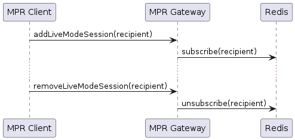
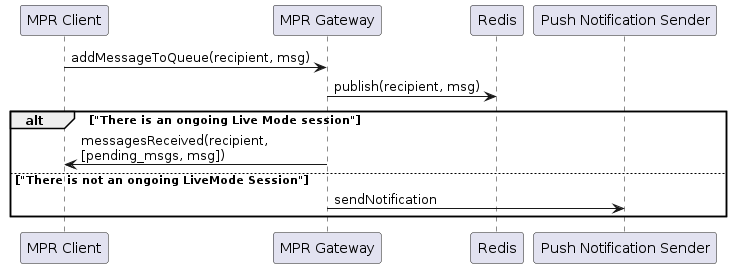
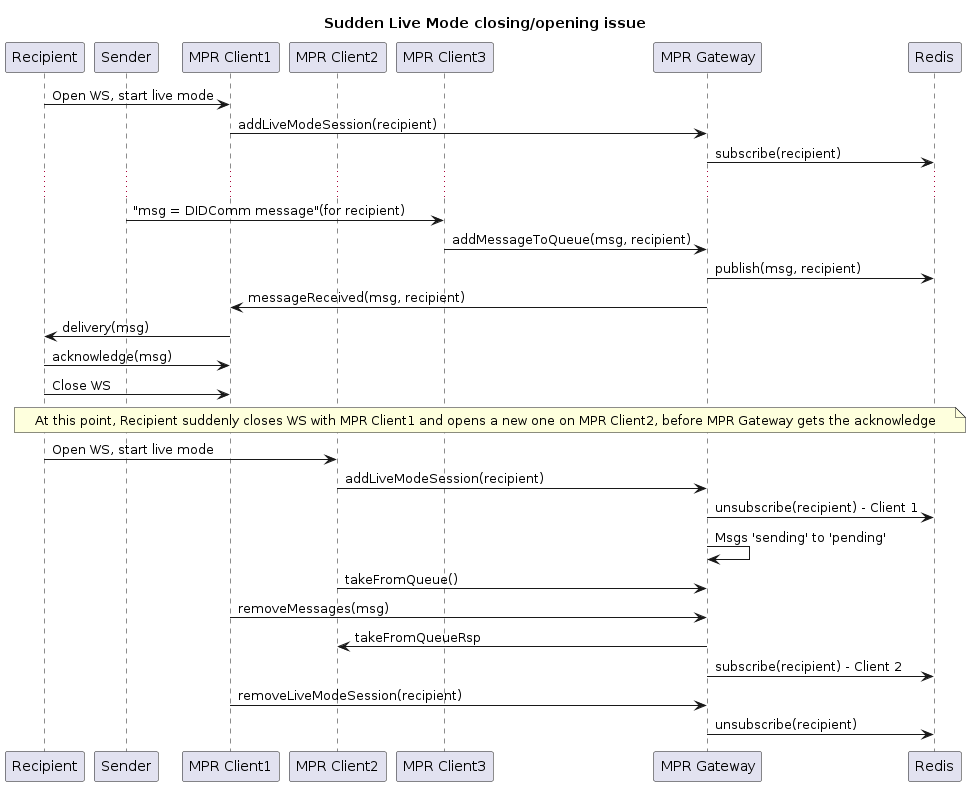

## Flows

In this document we can see some details of common flows involving different components of a deployment based on MPR.

### Live Mode Session Add/Remove

Whenever a DIDComm agent is connected to Mediator instance (MPR Client) and a Live Mode session is created, MPR must be informed about it in order to susbcribe to any incoming message for it. 

This Live Mode session will be indexed by the DID of the recipient.

Subscription will be canceled as soon as a client sends a `removeLiveModeSession` or another client initiates a new one with the same recipient. In such case, the newer session will get any incoming message and will retrieve all messages that were not acknowledge by the recipient.

> Note: MPR Gateway should take measures to give some time for recipients to acknowledge pending messages before re-sending them when creating a new session, since the previous one could have been lost due to a network failure on their device.

### DIDComm message received

All received DIDComm messages are added to Redis cache. In case there is an ongoing Live Mode session, the messages are forwarded to the subscriber client (i.e. the Mediator instance that holds such Live Mode session). MPR Gateway can take this opportunity to check for other pending messages for this recipient.

When there is not any subscriber for a recipient, it is assumed that it is not connected, so a Push notification is sent to the notification URI the recipient has provided. This URI would be part of optional parameters of `addMessage`, since ideally the MPR would not hold any persistent info regarding recipients other than their DID and messages.

### Multi-instance message and session management

In this example we have three different clients: two of them are Mediator instances that hold a Live Session to the Recipient (in different moments), while the third one just receives a message from an external Sender and posts it into the pickup queue.

