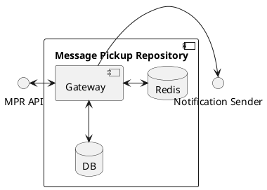
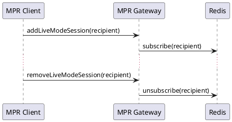
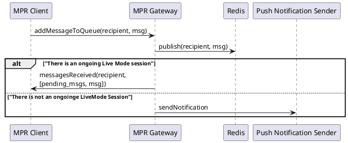
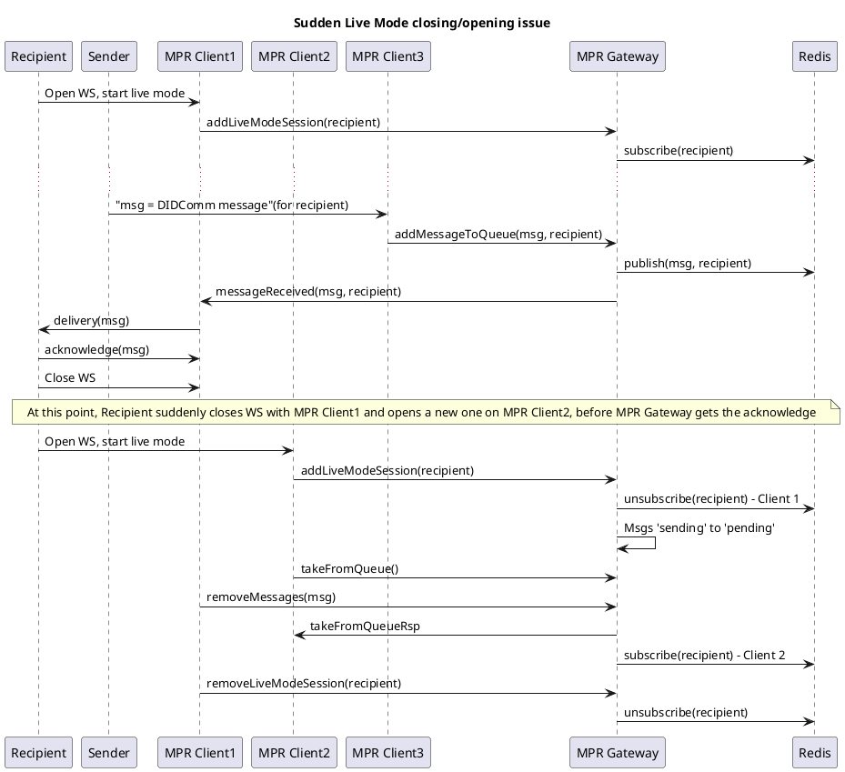

# Message Pickup Repository Architecture

Message Pickup Repository (MPR) consists of a Gateway that provides the API for its clients, a Redis cluster where messages are posted and a database used to persist messages that were sent to offline users, for further retrieval when they are back.  

In this diagram, Gateway englobes a component that is responsible for providing an API to the _MPR clients_ (which are usually Mediator instances) and maintaining WebSocket connections with them, querying and publishing into Redis and DB queue according to the messages received from them.

Redis is intended to be a cache where all incoming Message Pickup messages are stored temporarily until they are picked up either by their corresponding recipient (this implies it has explicitly acknowledged its reception), or a timeout, where they are persisted into the DB for further retrieval when the recipient is online.

MPR also interacts with a _Push Notification Sender_, responsible for notifying recipients who support Push notifications whenever a message is received while they are offline. This interface follows the API from [FCM Notification Sender](https://github.com/2060-io/fcm-notification-sender).

### API

MPR API consists mainly on messages to retrieve and add messages to pickup queue, and to add/remove Live Mode Message Pickup sessions in order to be notified when a DIDComm message for a given DIDComm recipient is received. 

- getAvailableMessageCount
- takeFromQueue
- addMessage
- removeMessages
- addLiveModeSession
- removeLiveModeSession
- messageReceived

The protocol is built on top of JSON-RPC 2.0 using WebSocket as transport. All methods match as much as possible (in terms of name and params) those of credo-ts' `MessagePickupRepository` interface, but adds some others used to handle sessions (subscriptions to Redis cache).

## Flows

### Live Mode Session Add/Remove

Whenever a DIDComm agent is connected to Mediator instance (MPR Client) and a Live Mode session is created, MPR must be informed about it in order to susbcribe to any incoming message for it. 

This Live Mode session will be indexed by the DID of the recipient.

Subscription will be canceled as soon as a client sends a `removeLiveModeSession` or another client initiates a new one with the same recipient. In such case, the newer session will get any incoming message and will retrieve all messages that were not acknowledge by the recipient.

> Note: MPR Gateway should take measures to give some time for recipients to acknowledge pending messages before re-sending them when creating a new session, since the previous one could have been lost due to a network failure on their device.

### DIDComm message received

All received DIDComm messages are added to Redis cache. In case there is an ongoing Live Mode session, the messages are forwarded to the subscriber client (i.e. the Mediator instance that holds such Live Mode session). MPR Gateway can take this opportunity to check for other pending messages for this recipient.

When there is not any subscriber for a recipient, it is assumed that it is not connected, so a Push notification is sent to the notification URI the recipient has provided. This URI would be part of optional parameters of `addMessage`, since ideally the MPR would not hold any persistent info regarding recipients other than their DID and messages.

### Multi-instance message and session management

In this example we have three different clients: two of them are Mediator instances that hold a Live Session to the Recipient (in different moments), while the third one just receives a message from an external Sender and posts it into the pickup queue.

